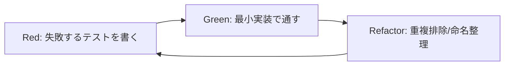
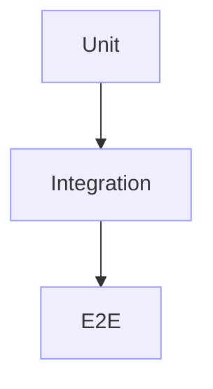

# Frontend 開発方針（tosk-front）

**目的**

* フロントエンド開発の最小原則を明文化し、品質と速度を両立する。
* 本書は **決めごと** を記す。迷った場合は本書に立ち返る。

**対象**

* Next.js App Router（Next 15）+ TypeScript + Mantine + Zustand
* テスト: Vitest（単体）/ Playwright（E2E）

---

## 1. 開発原則（確定）

### 1.1 TDD（Red → Green → Refactor）を採用

* 新規機能・バグ修正は **TDD** で進める。
* まず **失敗するテスト（Red）** を書き、最小実装で **Green**、その後 **Refactor**。
* コンポーネントは **最小の公開API（Props/イベント）** に絞る。副作用は `lib/*` に隔離。



### 1.2 正常系・異常系テストを最低限作成（必須）

* **正常系（Happy Path）**: 代表的なユーザ操作が期待通り動くこと。
* **異常系（Unhappy Path）**: 代表的な失敗条件を最低1件以上カバー。

    * 例：401/403/404/409/422/500、ネットワーク断、空データ、入力バリデーション失敗 等。
* 画面トースト/リダイレクト/ボタン無効化など **ユーザーに見える挙動** を検証する。

### 1.3 Unit と E2E を必ず用意（必須）

* **Unit（Vitest + RTL）**: コンポーネント・フック・ストアの単体。
* **E2E（Playwright）**: 利用者視点のストーリー。最低限、以下を常設する。

    * `login → dashboard → logout`
    * タスク一覧の基本操作（一覧→詳細→戻る）
    * 権限エラーの表現（403/404）



---

## 2. テスト設計ガイド

### 2.1 単体テスト（Vitest）

* 配置: `tests/unit/` に集約（コンポーネント直下の `__tests__` は使わない）。
* ランナー: `vitest`、描画は React Testing Library。
* API 呼び出しは **MSW** でモック。`/api` 経由のレスポンスを再現し、副作用をテストから分離。
* **命名規則**: `*.spec.ts(x)`。1ファイル1対象（コンポーネント/フック/ストア）。
* **時間・乱数**: `vi.useFakeTimers()` / `vi.spyOn(Math, 'random')` で決定論にする。

### 2.2 E2E テスト（Playwright）

* 配置: `tests/e2e/`。
* 環境: 原則ローカル `next dev` + ローカル API で走らせる。Preview/本番に対するE2Eは**スモーク**のみ。
* シナリオ:

    1. ログイン（クッキー付与）
    2. ダッシュボードの主要要素が存在する
    3. タスク一覧→詳細→戻る
    4. 権限のない操作で 403 が UI に反映される

### 2.3 境界の定義

* **Unit**: DOM単位（ボタン/カード）、関数/フック、Zustand ストア。
* **Integration**: 複数コンポーネントの連携（フォーム送信→API呼び出し結果の描画）。
* **E2E**: 実ブラウザ操作でのユーザストーリー。

### 2.4 ケース設計の最小セット

* 正常: 最短経路の操作が成功すること。
* 異常: 以下から**最低1件を選び**、UIの反応を確認。

    * 401 未認証 → ログインへ誘導
    * 409 Token Reuse → 再ログイン誘導
    * 403 権限なし → トースト/ガードで不可視
    * 422 入力不正 → フィールドエラー表示
    * 500 予期しない失敗 → 共通エラー表示

---

## 3. 具体の運用（確定）

### 3.1 スクリプト（例）

```json
{
  "scripts": {
    "dev": "next dev",
    "build": "next build",
    "start": "next start",
    "test": "vitest run",
    "test:watch": "vitest",
    "test:unit": "vitest run --dir tests/unit",
    "test:e2e": "playwright test",
    "test:e2e:ui": "playwright test --ui",
    "coverage": "vitest run --coverage"
  }
}
```

### 3.2 カバレッジ基準（最小）

* ステートメント/ブランチ **60%** 以上（初期）。重要導線は **80%** 目標。
* 閾値は `vitest.config.ts` の `coverage.thresholds` で固定。

### 3.3 テストデータ/モック

* **MSW**: `/api` をモック。代表的な正常/異常レスポンスをフィクスチャ化。
* **Playwright**: テストユーザを事前作成するか、ログインAPIでセットアップ。Cookie は `storageState` に保存可。

### 3.4 i18n とテスト

* 画面断定は **テキストではなくロール/ラベル** を優先（言語変更に強くする）。
* 固定文言を断定する必要がある場合は `data-testid` を付与して参照。

---

## 4. Definition of Done（DoD）

* [ ] TDD の Red/Green/Refactor を実施し、テストがグリーン
* [ ] 正常系・異常系の最低限テストが揃っている
* [ ] Unit と E2E が存在し、CI で通る
* [ ] ESLint（core-web-vitals）/ TypeScript strict を満たす
* [ ] UI の空/ローディング/エラー状態を実装・確認
* [ ] ドキュメント（該当箇所: `doc/` or ADR）を更新

---

## 5. CI/レビュー基準

* PR では `test:unit` と `test:e2e` を実行。Preview URL を貼る。
* 破壊的変更がある場合は ADR 追加、リリースノートに `BREAKING CHANGE:` を記載。
* スナップショットテストは多用しない（意味のある断定に限定）。

---

## 6. セキュリティ/認証に関するテスト要点

* axios は `withCredentials: true` 固定。`/api` への rewrite 前提で Cookie を第一者として運ぶ。
* 401/409/403/404 の UI 表現（誘導・非表示・トースト）を最低1ケースずつ E2E で確認。
* 機密情報（`requestId` 以外の内部メッセージ）は画面に出さない。

---

## 7. 付録: ディレクトリとテストの対応

```
app/ → tests/e2e/（ページ単位のストーリー）
components/ → tests/unit/（コンポーネント単体）
lib/（ロジック） → tests/unit/（関数/フック/ストア）
```
