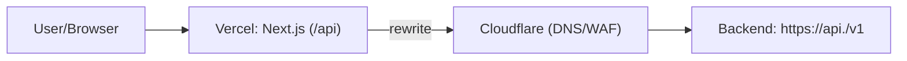
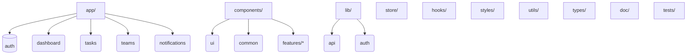

# tosk-front フォルダ構成ガイド

**目的**

* Next.js App Router（Next 15）+ TypeScript + Mantine + Zustand を前提に、フロントエンドのフォルダ構成と命名ルールを**決め切る**。
* バックエンドは `/v1` パスバージョニング。フロントは **`/api` に集約**して rewrite で `https://api.<domain>/v1` へ中継する（Cookie は第一者として運搬）。
* OpenAPI TypeScript クライアントは **GitHub Packages** から取得し、**リポジトリへ生成物はコミットしない**。

---

## 1. ルート構成

```
tosk-front/
  app/
    (auth)/login/page.tsx
    (auth)/signup/page.tsx
    (dashboard)/layout.tsx
    (dashboard)/page.tsx
    tasks/
      page.tsx
      [taskId]/page.tsx
    teams/
      page.tsx
      [teamId]/page.tsx
    notifications/page.tsx
    layout.tsx
    globals.css
    providers.tsx           # MantineProvider / Notifications を集約
    error.tsx
    loading.tsx
  components/
    ui/                     # Mantine 薄ラッパ（Button, Card など）
    common/                 # Header, Nav, Avatar, EmptyState, Guard
    features/
      auth/
      task/
      team/
      notification/
  lib/
    api/
      axios.ts             # axios インスタンス（baseURL:'/api', withCredentials:true）
      client.ts            # OpenAPI-TS クライアント初期化（npm配布物）
      fetch-server.ts      # Server Components 用の fetch ヘルパ（cookie 前方転送）
    auth/
      getSession.ts        # SSR で /auth/me を叩いてセッション取得
      requireAuth.tsx      # CSR ルートガード
    constants/
        app.ts # アプリ名、件数、日付フォーマット、UI閾値
        routes.ts # ルート定数 & ルートビルダー
        env.ts # 環境変数の読み取り/必須チェック
        feature-flags.ts # 実験フラグの定義
        regex.ts # 入力検証の共通正規表現
    errors/
        types.ts # ApiError 型（status/error/message/requestId）
        codes.ts # APIの error コード定義（ユニオン/enum）
        map.ts # ApiError → i18nキー/UX方針のマッピング
    i18n/
        config.ts # 対応言語、既定ロケール、t() 初期化
        t.ts # t('domain.key', params) の薄ラッパ
    logger.ts
  store/                   # Zustand stores（session, task, ui など）
    sessionStore.ts
    taskStore.ts
    uiStore.ts
  hooks/                   # useDebounce 等の汎用フック
  styles/
    theme.ts               # Mantine のテーマ定義（色/フォント/角丸）
  utils/                   # 日付/数値/型ガードなどの汎用関数
  types/                   # UI 固有の型定義（API 型とは分離）
  public/
  locales/
    ja/
        common.json
        errors.json # ユーザー向けエラー文言
        auth.json
        task.json
    en/
        common.json
        errors.json
        auth.json
        task.json
  doc/
    decision-records/      # ADR（意思決定の履歴）
  tests/
    unit/                  # Vitest + RTL（コンポーネント/ストア単体）
    e2e/                   # Playwright（ログイン～ダッシュボードなど）
  .npmrc                   # GitHub Packages（読み取りトークン）
  next.config.ts           # rewrites で /api -> https://api.<domain>/v1
  eslint.config.mjs
  tsconfig.json
  vitest.config.ts
  playwright.config.ts
  README.md
```

### 1.1 命名規則

* React コンポーネント: `PascalCase.tsx`
* フック: `useCamelCase.ts`
* その他（ユーティリティ/ストア/型）: `kebab-case.ts` or `snake_case` は不可、**`kebab-case` に統一**
* 画像・静的ファイル: `public/` 直下で `kebab-case`
* ディレクトリ名: 複数形を基本（`tasks/`, `teams/`）

---

## 2. ディレクトリの責務と禁止事項

### `app/`

* **責務**: ルーティングとページの骨格。Server/Client Components の選択は最小権限で。
* **必須**: `providers.tsx` に MantineProvider・Notifications を集約。
* **禁止**: `app/` 直下で axios を直接生成しない（`lib/api/axios.ts` を使用）。

### `components/`

* **責務**: 再利用 UI。
* **内訳**:

    * `ui/`: Mantine を薄ラップした汎用コンポーネント。
    * `common/`: ヘッダーやナビゲーション等のアプリ共通 UI。
    * `features/*`: ドメイン別 UI（auth/task/team/notification）。
* **禁止**: API 呼び出しを直接持たない（イベントを上げる）。

### `lib/`

* **責務**: API・認証・ロガー等のインフラ層。
* **決定**:

    * `api/axios.ts`: `baseURL:'/api'`, `withCredentials:true` 固定。
    * `api/client.ts`: OpenAPI-TS クライアント（npm: `@<owner>/tosk-openapi-client`）の初期化。**生成物はコミットしない**。
    * `api/fetch-server.ts`: SSR でリクエストの `cookie` を API へ前方転送。

### `store/`

* **責務**: Zustand による状態管理。`sessionStore`, `taskStore`, `uiStore` の機能分割。
* **禁止**: 直接 `fetch`/axios を呼ばない。`lib/api/*` を介す。

### `styles/`

* **責務**: Mantine テーマ定義・グローバル CSS のみ。
* **決定**: テーマトークン（色/角丸/影/フォント）はここで一元管理。

### `hooks/`

* **責務**: 汎用フック（`useDebounce`, `useDisclosure` の薄い自前ラッパ等）。

### `types/`

* **責務**: UI 専用型。API 型は OpenAPI クライアント由来の型を利用。

### `doc/`

* **責務**: フロント専用ドキュメントの集約（本書、API 契約、権限、リリース、UI ガイドなど）。
* **決定**: 意思決定は `decision-records/ADR-*.md` に残す。

### `tests/`

* **責務**: 単体/E2E テストの配置。コンポーネント直下の `__tests__` は使用しない（`tests/` に集約）。

---

## 3. API 到達ルール

* **唯一の入り口は `/api`**。`next.config.ts` の `rewrites()` で `https://api.<domain>/v1` に中継し、**第一者 Cookie** として扱う。
* クッキー認証: `withCredentials: true` を **必須**。トークンの localStorage 保管は **禁止**。
* SSR は `lib/api/fetch-server.ts` を使い、受け取った `cookie` を前方転送して `/auth/me` 等を叩く。

```ts
// 例: lib/api/axios.ts
import axios from "axios";
export const axiosInstance = axios.create({ baseURL: "/api", withCredentials: true });
```

---

## 4. OpenAPI クライアント

* 供給: GitHub Packages `@<owner>/tosk-openapi-client`。
* バージョン: 安定は `^1`、先行検証は `@next`（PR限定）。
* **禁止**: `generated/` ディレクトリの生成物をリポジトリにコミットしない。

---

## 5. 設定ファイル

* `.npmrc` – GitHub Packages のレジストリ/トークン（Vercel では環境変数 `GITHUB_TOKEN_READ` を使用）。
* `next.config.ts` – `/api` → `https://api.<domain>/v1` の rewrite を定義。
* `eslint.config.mjs` – next/core-web-vitals + import 順序ルール。
* `tsconfig.json` – `strict: true`, `baseUrl:"."`, `paths:{"@/*":["./*"]}` を利用可。
* `vitest.config.ts`, `playwright.config.ts` – テスト設定をここで集中管理。

---

## 6. 図解





---

## 7. 変更時のガードレール

* フォルダの新設/改名は ADR を追加してから実施（`doc/decision-records/ADR-*.md`）。
* `/v2` 以降の API へ移行する場合は、`next.config.ts` の rewrite 先を切替。併存期間は `/v1` を残す。
* 例外は必ずドキュメントへ反映（**このファイルが単一の真実源**）。

---

## 付記

* Node.js は LTS（推奨: 20.x 以上）。
* パッケージマネージャは npm を既定（lockfile は `package-lock.json`）。
