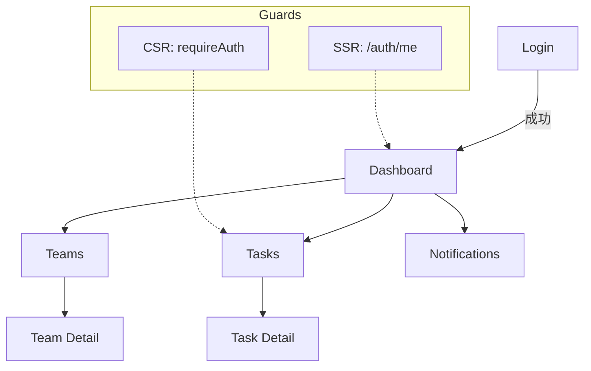

# Frontend 必要画面構成（tosk-front）

**目的**

* 本書はフロントエンドの**必要画面**と**ルーティング**、**データ依存**、**認可（可視性/操作可否）**、\*\*状態（空/読込中/エラー）\*\*を確定する。
* Next.js App Router（Next 15）+ TypeScript + Mantine + Zustand 前提。API は `/api → https://api.<domain>/v1` へ rewrite（Cookie 第一者）。

**対象スコープ（MVP）**

* 認証: Login / Signup / Logout / Session 初期化（/auth/me）
* ダッシュボード
* タスク: 一覧 / 詳細
* チーム: 一覧 / 詳細（参加申請/承認）
* 通知: 一覧
* 共通: 403/404、グローバルヘッダー/ナビ、トースト、ガード

---

## 1. ルートマップ（確定）

```
app/
  (auth)/login/page.tsx        →  /login
  (auth)/signup/page.tsx       →  /signup
  (dashboard)/layout.tsx       →  /  （ダッシュボード）
  (dashboard)/page.tsx         →  /
  tasks/page.tsx               →  /tasks
  tasks/[taskId]/page.tsx      →  /tasks/:taskId
  teams/page.tsx               →  /teams
  teams/[teamId]/page.tsx      →  /teams/:teamId
  notifications/page.tsx       →  /notifications
  error.tsx / loading.tsx / layout.tsx
```

> すべての保護ページは **SSRガード** を適用する（`/auth/me` の結果で 401→`/login` へ）。CSR 遷移時は `requireAuth` で重ねて保護。

---

## 2. 画面仕様（MVP）

### 2.1 Login（/login）

* **目的**: 認証（AT/RT を Cookie で受領）。
* **API**: `POST /auth/login` → Set-Cookie。成功後 `GET /auth/me` でセッション初期化。
* **状態**: 読込中（送信中）/ 失敗（資格情報誤り）/ 成功（`/` へ遷移）。
* **アクセシビリティ**: ラベル/説明/エラーテキストを関連付け（`aria-describedby`）。
* **テスト**: 正常（ログイン成功→ダッシュボード表示）、異常（401 → エラートースト）。

### 2.2 Signup（/signup）

* **目的**: 新規登録。
* **API**: `POST /auth/signup`（成功後は自動ログイン or /login へ誘導）。
* **状態**: 入力検証 / 既存メール 409 / 成功トースト。

### 2.3 Dashboard（/）

* **目的**: 直近の自分のタスク、所属チームのアクティビティ、未読通知数の要約。
* **データ**: `GET /tasks?mine=true&limit=…`, `GET /teams?joined=true`, `GET /notifications?unread=true&limit=…`。
* **認可**: 認証必須。ボタン表示は権限と可視性（private/team/public）に応じて切替。
* **状態**: 空（タスク0件）、読込中（スケルトン）、エラー（再試行ボタン）。
* **テスト**: 正常（要約が描画）、異常（API 500→共通エラー）。

### 2.4 Tasks 一覧（/tasks）

* **目的**: タスク一覧の表示/検索/フィルタ/ページング。
* **API**: `GET /tasks?query=&visibility=&teamId=&page=`
* **認可**: `private` は作成者のみ、`team` は所属メンバー、`public` は認証ユーザー。
* **UI要素**: 検索、可視性フィルタ、ソート、行クリック→詳細へ。
* **状態**: 空（ヒント表示）、読込中（テーブルスケルトン）、エラー。
* **テスト**: 正常（検索で絞り込み）、異常（403/404 の非表示/誘導）。

### 2.5 Task 詳細（/tasks/\:taskId）

* **目的**: タスク詳細表示（閲覧）。
* **API**: `GET /tasks/:id`
* **認可**: 可視性に基づく。表示不可は 404 相当で扱う（情報漏えい防止）。
* **状態**: 読込中/エラー（404/403/500）。
* **将来拡張**: 編集/コメント/履歴。

### 2.6 Teams 一覧（/teams）

* **目的**: 所属チームと参加可能なチームの一覧。
* **API**: `GET /teams?joined=true`, `GET /teams?discoverable=true`
* **操作**: 参加申請（`POST /teams/:id/join`）。
* **状態**: 申請中/承認待ち/却下。

### 2.7 Team 詳細（/teams/\:teamId）

* **目的**: メンバー/概要/最新アクティビティ表示。管理権限者は承認/却下操作。
* **API**: `GET /teams/:id`, `GET /teams/:id/members`, `POST /teams/:id/approve|reject`
* **認可**: OWNER/MEMBER（UIはボタン表示で制御、最終判定はサーバ）。

### 2.8 Notifications 一覧（/notifications）

* **目的**: 通知の既読/未読管理。
* **API**: `GET /notifications`, `POST /notifications/:id/read`
* **UI**: 種別フィルタ、未読バッジ、全て既読。

### 2.9 共通エラー/空/ローディング

* **error.tsx**: 予期しないエラーのフォールバック。
* **loading.tsx**: ページ級のスケルトン。
* 各画面は **空（EmptyState）/エラー（再試行）/ローディング** を必ず実装。

---

## 3. 認証・認可の適用（確定）

### 3.1 SSR ガード

* 保護ページ（Dashboard/Tasks/Teams/Notifications/TaskDetail/TeamDetail）は `getSession()` を SSR で実行。
* 401 は `redirect('/login')`。Cookie は RSC の fetch で前方転送。

### 3.2 可視性（Task）と役割（Team）

* **Task.visibility**: `private`（作成者のみ）/`team`（所属メンバー）/`public`（認証ユーザー）。
* **Team.role/status**（UI層）: OWNER/MEMBER、PENDING/JOINED/REJECTED。操作ボタンはロール/ステータスで表示切替（最終判定はサーバの 403/404）。

### 3.3 エラーの画面表現

* API エラーは `ApiError` に正規化 → `lib/errors/map.ts` で i18n キーへ変換。
* 401/409 は再ログイン誘導、403 は不可視/トースト、404 はページの空表示、500 は共通エラー。

---

## 4. データ取得戦略（確定）

* **初期描画**: SSR（RSC）で取得。Cookie 前方転送。
* **相互作用**: CSR（クライアントコンポーネント）で再取得。SWR 風の再検証を許容。
* **ページング**: クエリパラメータ（`page`,`limit`,`sort`）。

---

## 5. UI 骨格（共通コンポーネント）

* `Header` / `SideNav` / `AppShell` / `EmptyState` / `ErrorState` / `SkeletonTable`
* `Guard`（CSR ルートガード）/ `Toast`（i18n 済みメッセージ）

---

## 6. 画面遷移図



---

## 7. 受け入れ条件（E2E 最低セット）

1. **ログインフロー**: /login で認証 → Cookie 設定 → / へ遷移 → ユーザー名表示。
2. **タスク閲覧**: /tasks で一覧が表示され、行クリックで詳細へ移動できる。
3. **権限エラー**: 権限のない操作で 403 → トースト表示＆ボタン無効化。
4. **未読通知**: /notifications で未読バッジが表示され、既読操作が反映される。

---

## 8. 将来拡張（V2+）

* プロフィール/設定（言語切替、通知設定）
* タスク作成/編集/コメント/履歴
* チーム招待リンク/ロール管理 UI
* 検索の保存/共有、通知センターのリアルタイム更新（SSE/WebSocket）

---

## 9. 実装ノート

* i18n: 画面断定はロール/ラベル優先。テキスト断定が必要な場合は `data-testid` を付与。
* アクセシビリティ: フォーム入力はラベル必須、エラーは `aria-live=polite`。
* パフォーマンス: 一覧は仮想化は不要（MVP）。ページングとスケルトンで体感速度を確保。

---

## 10. 変更手順

* 画面の追加/削除/改名は ADR を作成（`doc/decision-records/ADR-*.md`）。
* API 破壊変更は `/v2` の導入と同時に画面側の rewrite 先を切替。旧 `/v1` と併存期間を設ける。
